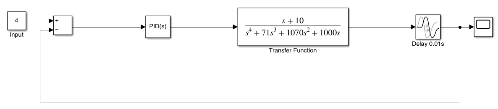
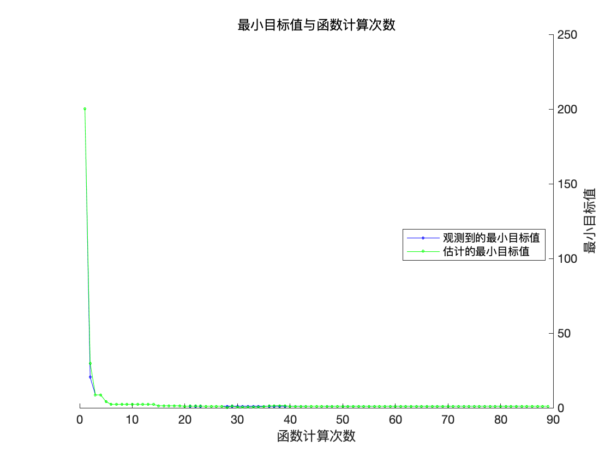
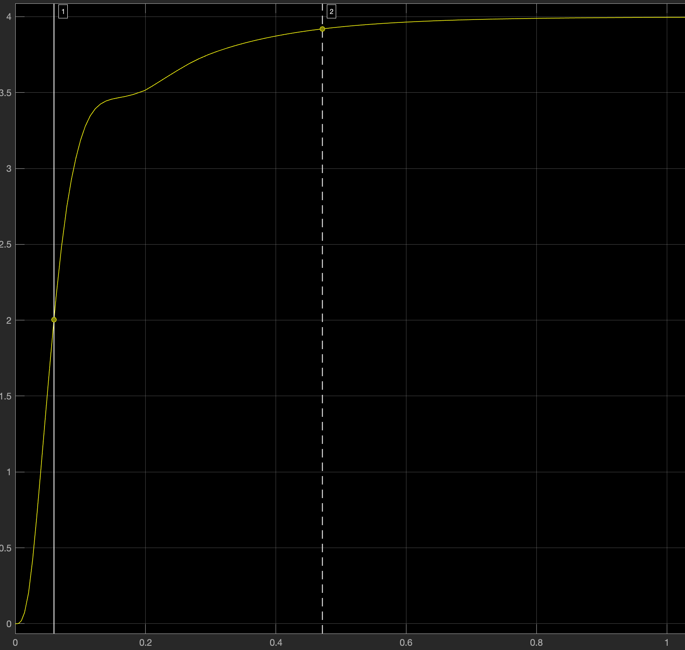

# PIDController

Optimizing PID controller parameters for elevator control.

$$
G(s) = \frac{s+10}{s(s+1)(s+20)(s+50)}
$$

Open-Loop Transfer Function with PID controller:
$$
G^\prime(s) = (K_p + K_i/s + K_ds)G(s)
$$

The visualized system can be found in elevator_simulink.slx.

We want to find the best values for the PID controller, aiming to minimize overshoot, setting time, and bumpiness.

So the loss function can be written using the response $r$:
$$
\begin{align*}
L_{\text{overshoot}} &= |\max(r) - 4.0| \\
L_{\text{setting}} &= \arg\max_t |r(t) - 4.0| > 4.0 \times 2\%\\
L_{\text{bumpy}} &= \sum_{t}|r(t+\Delta(t)) - r(t)|\\
L_{\text{total}} &= w_o L_{\text{overshoot}} + w_sL_{\text{setting}} + w_b L_{\text{bumpy}}
\end{align*}
$$

We utilize bayesian optimization to find the minimum of the loss function. The code is shown in optimize.m.

The picture below gives a visualization of the optimization process.

Response:

Parameters:

| Name     |  Value    |
| ---- | ---- |
|  $K_p$    | 1050     |
|  $K_i$    |  0    |
|  $K_d$    | 1050     |

Metrics:

| Name          | value |
| ----------- | ----- |
| $T_d$       | 0.059 |
| $T_r$ | 0.206 |
| $T_p$ | $\infty$ (as $\sigma\%=0$) |
| $T_s$ ($2\%$) | 0.471 |
| $\sigma\%$ | 0 |

